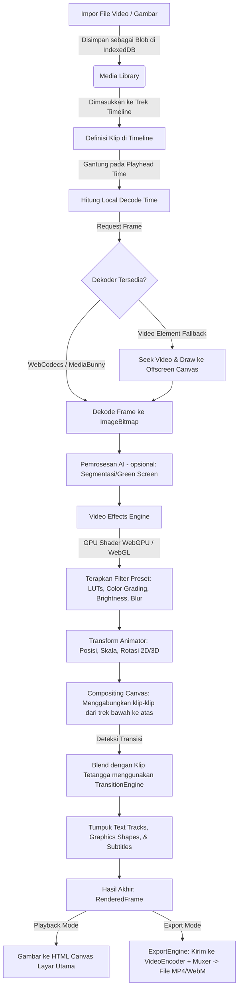

# Konteks Proyek Openreel (Video & Audio Editor)

Dokumen ini menjelaskan arsitektur sistem, struktur proyek, dan alur pemrosesan media (dari import hingga rendering) dalam Openreel.

---

## 1. Bahasa Pemrograman yang Digunakan

Openreel dibangun dengan teknologi modern berbasis browser dengan performa tinggi:
- **TypeScript & JavaScript (ES Modules):** Digunakan untuk mendefinisikan logika aplikasi frontend React, state management, UI, serta core rendering engine (video, audio, playback, transitions, effects).
- **AssemblyScript:** Digunakan untuk menulis kode tingkat rendah yang dikompilasi ke **WebAssembly (WASM)**. Digunakan untuk operasi intensif matematika seperti FFT (Fast Fourier Transform), beat-detection (deteksi ketukan audio), dan enkoder/dekoder WAV.
- **HTML5 & CSS3 (Tailwind CSS):** Digunakan untuk struktur visual dan sistem antarmuka pengguna (UI).

---

## 2. Struktur Folder Proyek

Openreel dirancang menggunakan pola **Monorepo** yang dikelola menggunakan `pnpm workspaces`. Berikut adalah struktur folder penting:

```
open-reel/
├── apps/                         # Aplikasi Web
│   ├── web/                      # Aplikasi web editor utama (React + Vite + Zustand)
│   └── image/                    # Sub-aplikasi editor gambar/foto
├── packages/                     # Pustaka & Logika Core Shared
│   ├── core/                     # Inti logika video/audio engine, WASM, dan export engine
│   │   └── src/
│   │       ├── actions/          # Command pattern untuk undo/redo
│   │       ├── ai/               # AI background removal & person segmentation
│   │       ├── audio/            # Pemrosesan audio multi-track
│   │       ├── export/           # Pengkodean dan rendering file hasil export
│   │       ├── graphics/         # Logika shape, SVG, sticker
│   │       ├── playback/         # Playback controller dan sinkronisasi clock
│   │       ├── text/             # Title engine & perenderan teks
│   │       ├── timeline/         # Manajemen klip dan trek
│   │       ├── types/            # Tipe data TypeScript global
│   │       ├── video/            # Perenderan video frame-by-frame (WebGPU/WebGL)
│   │       └── wasm/             # Sumber kode AssemblyScript untuk WASM
│   ├── ui/                       # Kumpulan komponen UI bersama (shadcn/ui + Radix)
│   └── image-core/               # Inti logika pemrosesan gambar
├── node_modules/                 # Dependensi proyek
├── package.json                  # Konfigurasi workspace monorepo
└── pnpm-workspace.yaml           # Definisi workspace pnpm
```

---

## 3. File-File Utama (Main Files)

Berikut adalah file-file penting yang mengatur alur jalannya aplikasi:

1. **`packages/core/src/video/video-engine.ts`**
   Mengatur perenderan frame video tunggal secara real-time. Bertanggung jawab atas pencarian frame (decode), caching frame, pemanggilan efek, komposisi visual multi-track menggunakan GPU/CPU, dan pengolahan transisi.
2. **`packages/core/src/video/video-effects-engine.ts`**
   Mengatur penerapan efek shader ke video frame. Memutuskan penggunaan WebGL atau WebGPU dan menghubungkannya dengan generator shader filter.
3. **`packages/core/src/export/export-engine.ts`**
   Mengontrol proses rendering offline (exporting). Melakukan loop berurutan per frame, meminta perenderan dari `VideoEngine` dan `AudioEngine`, lalu menulis aliran data (stream) ke format MP4/WebM menggunakan pustaka WebCodecs.
4. **`packages/core/src/playback/playback-controller.ts`**
   Mengontrol jalannya waktu pemutaran (play/pause/seek) secara real-time dan menjaga sinkronisasi antara visual canvas dengan pemutaran audio.
5. **`apps/web/src/stores/project-store.ts`**
   Zustand store utama yang menampung semua data proyek aktif (daftar media, struktur trek, klip, efek, undo/redo history stack, dan fungsi mutasi timeline).
6. **`apps/web/src/stores/timeline-store.ts`**
   Zustand store yang melacak posisi jarum pemutaran (playhead), status scrubbing, tingkat zoom visual, dan ukuran grid timeline.

---

## 4. Class & Abstraksi Penting

- **`VideoEngine` (`packages/core/src/video/video-engine.ts`)**
  Menggabungkan seluruh trek video/gambar, memecahkan (decode) frame dari blob media, menerapkan transformasi 2D/3D, dan menggambar hasil akhirnya ke `OffscreenCanvas`.
- **`PlaybackController` & `MasterTimelineClock` (`packages/core/src/playback/`)**
  Bertanggung jawab atas jalannya playhead dengan presisi tinggi dan sinkronisasi audio-video selama pemutaran.
- **`ExportEngine` (`packages/core/src/export/export-engine.ts`)**
  Mesin pengekspor video yang mengemas visual frame dan buffer audio mentah ke dalam container video file.
- **`VideoEffectsEngine` & `WebGPUEffectsProcessor` (`packages/core/src/video/`)**
  Menggunakan shader untuk memproses efek visual (seperti color grading, LUTs, chroma key, mask, blur) langsung di GPU.
- **`ActionExecutor` & `ActionHistory` (`packages/core/src/actions/`)**
  Penerapan design pattern *Command* untuk melacak setiap perubahan timeline, memungkinkan fitur Undo dan Redo yang aman.

---

## 5. Dependensi Utama (Dependencies)

- **`mediabunny`:** Library internal/eksternal utama berbasis **WebCodecs API** untuk melakukan dekode dan enkode video secara berkinerja tinggi langsung di browser tanpa overhead berat.
- **`@ffmpeg/ffmpeg` / `@ffmpeg/core`:** Porting WebAssembly dari FFmpeg. Digunakan sebagai *fallback* untuk membaca berkas media yang tidak didukung secara native oleh WebCodecs browser atau untuk proses pemaksaan format (transcoding).
- **`@mediapipe/tasks-vision`:** Mengintegrasikan model AI MediaPipe untuk fitur pintar seperti penghapusan latar belakang video (*background removal*) dan segmentasi objek manusia (*person segmentation*) secara lokal di browser.
- **`zustand`:** Digunakan untuk pengelolaan state global yang reaktif di aplikasi web React.
- **`gsap` & `framer-motion`:** Library animasi premium yang digunakan untuk transisi UI yang halus, micro-animations, dan animasi teks/grafik di timeline.
- **`three.js` (Three):** Digunakan untuk rendering 3D, efek perspektif 3D pada klip, dan manipulasi ruang GPU.
- **`assemblyscript`:** Digunakan untuk mengompilasi algoritma pemrosesan sinyal cepat (audio FFT) menjadi modul WebAssembly (`.wasm`).

---

## 6. Bagaimana Timeline Bekerja

### Struktur Data (Model)
Timeline didesain dengan konsep trek bertingkat (multi-track):
- **`Timeline`:** Berisi array dari `Track`, informasi `Subtitles`, total `duration`, dan penanda (`Markers`).
- **`Track`:** Memiliki tipe tertentu (`video`, `audio`, `image`, `text`, `graphics`) serta daftar `Clip` dan `Transition`.
- **`Clip`:** Mewakili elemen media di timeline. Berisi properti penting:
  - `startTime`: Posisi awal klip diletakkan di timeline (detik).
  - `duration`: Panjang durasi klip di timeline.
  - `inPoint` & `outPoint`: Batas potong internal klip dari file media sumber (source trimming).
  - `effects` & `audioEffects`: Daftar efek yang diterapkan ke klip tersebut.
  - `transform`: Transformasi spasial klip (posisi, skala, rotasi, opacity, cropping).

### Alur Kerja Sinkronisasi (Real-time Playback)
1. Ketika pemutaran dimulai, `PlaybackController` menjalankan loop pemutaran menggunakan `requestAnimationFrame` dan `MasterTimelineClock`.
2. Di setiap frame, posisi playhead terbaru diperbarui ke `playheadPosition` di `useTimelineStore`.
3. Komponen Canvas mendengarkan perubahan ini dan memicu fungsi `VideoEngine.renderFrame(project, time)`.
4. `VideoEngine` menghitung klip mana saja yang aktif pada posisi waktu (`time`) tersebut berdasarkan rentang `[startTime, startTime + duration]`.
5. Frame klip aktif didekode dari media biner (Blob) pada posisi waktu lokal klip:
   $$\text{Local Decode Time} = \text{time} - \text{clip.startTime} + \text{clip.inPoint}$$
6. Frame yang berhasil didekode kemudian diproses melalui efek, ditransformasikan, dan digambar ke canvas menggunakan urutan tumpukan track (Painter's Algorithm).

---

## 7. Bagaimana Efek Video Diproses (Video Effects Pipeline)

Alur pemrosesan efek video dari berkas impor hingga rendering akhir mengikuti diagram dan langkah-langkah di bawah ini:

### Diagram Alur Data Video



### Penjelasan Detil Alur Efek Video & Rendering:

1. **Importing & Storage:**
   - File media diimpor oleh pengguna, dibaca sebagai `File` / `Blob`, dan disimpan secara lokal menggunakan `idb-keyval` (IndexedDB) agar tidak membebani memori RAM browser secara terus-menerus.
2. **Decoding Frame:**
   - Ketika playhead berada di posisi tertentu, `VideoEngine` meminta frame dari media terkait.
   - Menggunakan `MediaBunny` (WebCodecs), engine mengekstrak frame video tepat pada waktu yang diminta menjadi sebuah objek `ImageBitmap`. Operasi ini sangat cepat dibandingkan seek standar HTML5 video.
   - Jika browser tidak mendukung WebCodecs, sistem akan memicu fallback dengan membuat `HTMLVideoElement` secara dinamis, melakukan `seek` ke waktu target, lalu menggambar frame video tersebut ke canvas perantara.
3. **AI Pre-Processing (opsional):**
   - Sebelum efek warna diaplikasikan, frame mentah (`ImageBitmap`) dikirim ke AI Engine jika fitur penghapusan latar belakang diaktifkan. Model segmentasi berjalan di CPU/GPU via WebAssembly TensorFlow/MediaPipe untuk menghapus background atau melakukan chroma keying.
4. **Efek & Shading Pipeline:**
   - `VideoEffectsEngine` menerima frame yang telah didekode.
   - Komponen efek akan diproses melalui WebGPU (menggunakan `WebGPUEffectsProcessor`) atau WebGL (menggunakan `canvas2d-fallback-renderer` / custom shader).
   - Filter-filter seperti kecerahan, saturasi, kontras, vignetting, modifikasi kurva RGB, dan pemetaan tabel warna (LUTs) diaplikasikan menggunakan shader GPU khusus.
5. **Transformasi & Komposisi Spasial:**
   - Frame yang telah diberi filter kemudian disesuaikan ukurannya, diposisikan, diputar (termasuk rotasi 3D jika diaktifkan), dan dipotong (*crop*) sesuai properti `transform` klip.
   - Trek video dirender menggunakan **Painter's Algorithm** dari trek paling bawah (indeks trek tinggi) menumpuk ke trek atas (indeks trek rendah) untuk memastikan klip di trek atas menutupi klip di bawahnya.
6. **Pemrosesan Transisi (Transitions):**
   - Jika terdapat tumpukan transisi (misalnya crossfade atau wipe) antara klip A dan klip B, `TransitionEngine` akan mendekode kedua klip tersebut secara bersamaan pada waktu transisi, mencampurkan (blend) kedua tekstur tersebut di GPU sesuai dengan kurva transisi, dan menggambarkannya ke canvas utama.
7. **Penyematan Overlay (Text & Graphics):**
   - Setelah semua video dan gambar selesai dikomposisikan ke canvas perantara, trek teks (`text`) dan trek grafis (`graphics`) digambar di atas video. Teks dirender menggunakan Canvas 2D Text API dengan dukungan font kustom dan animasi GSAP, sedangkan grafis dirender dari data SVG atau sticker.
8. **Output Akhir (Rendering/Export):**
   - **Mode Playback:** Hasil canvas `OffscreenCanvas` dipindahkan ke canvas layar utama (`HTMLCanvasElement`) secara real-time pada 30/60 FPS.
   - **Mode Export:** Frame-frame yang dirender dikirim satu per satu ke `VideoEncoder` WebCodecs melalui `ExportEngine`. Audio dirender dari trek audio, dicampur, lalu disandikan dengan `AudioEncoder`. Kedua aliran data video dan audio ini disatukan kembali (*multiplexing* / *muxing*) oleh MediaBunny menjadi file final seperti `.mp4` atau `.webm` yang dialirkan langsung ke penyimpanan disk pengguna melalui File System Access API.
