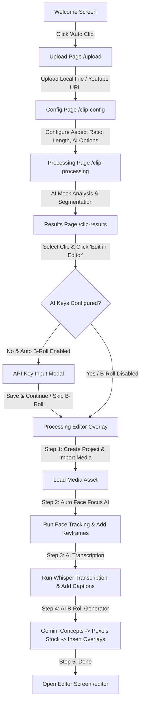

# Alur Kerja Fitur Auto Clip — OpenReel Video

Dokumen ini menjelaskan secara rinci alur pengerjaan, arsitektur, dan integrasi AI pada fitur **Auto Clip** di OpenReel Video. Fitur ini dirancang untuk memotong video berdurasi panjang menjadi klip-klip pendek (Shorts/TikTok/Reels) berasio 9:16 secara otomatis dengan pemrosesan AI dinamis.

---

## 🗺️ Diagram Alur Fitur (Workflow Diagram)

---

## 📋 Tahapan Alur & Detail Teknis

### 1. Entry Point — Welcome Screen
* **Lokasi File**: [WelcomeScreen.tsx](file:///c:/Users/hafid/Documents/web/open-reel/apps/web/src/components/welcome/WelcomeScreen.tsx)
* **Deskripsi**: Menambahkan card menu **Auto Clip** premium dengan warna gradient ungu-pink mencolok dan badge "AI-Powered". Ketika diklik, user diarahkan ke rute `/upload`.

### 2. Pengunggahan & Impor Video (`/upload`)
* **Lokasi File**: [AutoClipUploadPage.tsx](file:///c:/Users/hafid/Documents/web/open-reel/apps/web/src/pages/auto-clip/AutoClipUploadPage.tsx)
* **Fungsi**: 
  * **Device Upload**: Drag-and-drop zone untuk membaca metadata & durasi file lokal.
  * **YouTube Import**: Memasukkan URL video YouTube, mengambil preview thumbnail via oEmbed API, dan mengunduh video sampel default (`ForBiggerBlazes.mp4`) di latar belakang sebagai sumber file manipulasi proyek.
* **Hasil**: Objek sumber video (`VideoSource`) disimpan di Zustand store.

### 3. Konfigurasi Klip AI (`/clip-config`)
* **Lokasi File**: [AutoClipConfigPage.tsx](file:///c:/Users/hafid/Documents/web/open-reel/apps/web/src/pages/auto-clip/AutoClipConfigPage.tsx)
* **Fungsi**: User mengatur parameter pembuatan klip:
  * **Output Format**: Rasio Video (default 9:16, 16:9, 1:1, 4:5) dan batas durasi per klip (15s, 30s, 60s, Auto).
  * **Fitur AI**: Auto Face Focus, Auto B-Roll, dan AI Viral Recommendation.
  * **Style Subtitle**: Pilihan style animasi subtitel (*Bounce*, *Typewriter*, *Pop In*, dll).

### 4. Segmentasi & Simulasi AI (`/clip-processing` & `/clip-results`)
* **Lokasi File**: [AutoClipProcessingPage.tsx](file:///c:/Users/hafid/Documents/web/open-reel/apps/web/src/pages/auto-clip/AutoClipProcessingPage.tsx) & [AutoClipResultsPage.tsx](file:///c:/Users/hafid/Documents/web/open-reel/apps/web/src/pages/auto-clip/AutoClipResultsPage.tsx)
* **Fungsi**:
  * Menganalisis metadata video dan membaginya secara cerdas ke dalam klip-klip potensial berdasarkan panjang video dan filter kata kunci dari judul video.
  * Menghitung nilai skor viral (viral score), teks pemicu (hook text), dan pratinjau transkrip unik untuk masing-masing klip pendek.
  * Menampilkan galeri klip pendek bergradasi warna di panel kiri dan detail metrik klip di panel kanan.

### 5. Integrasi Dinamis & Pemrosesan Editor
Ketika user memilih klip dan mengklik tombol **Edit in Editor**, sistem menjalankan pipeline AI terintegrasi dengan status visual (Glassmorphism progress overlay):

| Langkah Pemrosesan | Teknologi / Service | Mekanisme & Output |
| :--- | :--- | :--- |
| **1. Import & Place** | `createNewProject`, `importMedia` | Membuat proyek baru berskala aspect ratio terpilih. Mengimpor file video asli, menaruhnya di timeline, dan memotongnya (`trimClip`) tepat di segmen klip terpilih (`startTime` s/d `endTime`). |
| **2. Auto Face Focus** | `AutoReframeBridge.runAutoFocusFace` | AI mengekstrak frame video pembicara, mendeteksi koordinat wajah pembicara menggunakan model deteksi browser lokal, menghitung posisi median, dan memasang keyframe crop otomatis agar wajah pembicara tetap berada di pusat rasio 9:16. |
| **3. AI Transcription** | `TranscriptionService` (Whisper) | Mengambil audio dari klip video yang telah dipotong, mengirim ke endpoint Whisper API (`https://cloud.openreel.video/transcribe`), menghasilkan subtitel berbasis kata per detik, dan memasangnya ke track `Captions` dengan style animasi pilihan user. |
| **4. AI Auto B-Roll** | Gemini API & Pexels Video API | Menganalisis teks subtitel menggunakan Gemini untuk merekomendasikan konsep stock footage visual. Melakukan pencarian video stok landscape HD di Pexels, mengunduhnya, menaruhnya di track `B-Roll` di atas trek pembicara utama, dan menonaktifkan audionya. |

---

## 🔑 Pengaturan Kunci API (B-Roll)
Fitur **Auto B-Roll** membutuhkan kunci API yang valid untuk berjalan:
1. **Gemini API Key**: Digunakan untuk menganalisis konteks transkrip dan memberikan rekomendasi keyword stock video.
2. **Pexels API Key**: Digunakan untuk melakukan pencarian dan download video stock gratis landscape.

> [!NOTE]
> Jika kunci API belum terisi di `localStorage` saat mengklik tombol *Edit in Editor*, modal popup input API key akan muncul agar user dapat langsung memasukkannya tanpa mengganggu jalannya proses. User juga dapat memilih opsi *Skip B-Roll* jika ingin langsung memproses transkripsi dan face reframing saja.
